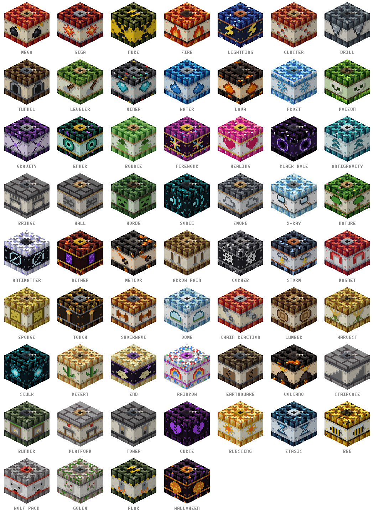

# TNT Arsenal

Sixty kinds of TNT for Minecraft 26.2 (Fabric), each with its own hand-drawn
look and its own way of going off. They are crafted at an ordinary crafting table,
so **JEI and REI show every recipe**.



| Kind | What it does | Recipe (shapeless) |
|---|---|---|
| Mega TNT | twice the power of TNT | 4 × TNT |
| Giga TNT | four times the power of TNT | 4 × Mega TNT + blaze powder |
| Nuke TNT | round crater, mushroom cloud, scorched land and three minutes of radiation | 4 × Giga TNT + nether star |
| Fire TNT | sets everything around alight | TNT + fire charge |
| Lightning TNT | a ring of lightning | TNT + lightning rod |
| Cluster TNT | bursts into eight TNT | 3 × TNT + 2 × gunpowder |
| Drill TNT | a clean 3×3 shaft up to 64 deep, with a ladder | TNT + iron pickaxe |
| Tunnel TNT | a clean 3×3 tunnel, 48 long, with torches | 2 × TNT + rail |
| Leveler TNT | clears a plot: radius 10, 16 high | TNT + iron shovel |
| Miner TNT | removes stone and dirt, leaves the ores | TNT + stone pickaxe + redstone |
| Water TNT | floods its crater | TNT + water bucket |
| Lava TNT | fills its crater with lava | TNT + lava bucket |
| Frost TNT | freezes water, lava and creatures | TNT + packed ice + snowball |
| Poison TNT | leaves a cloud of poison | TNT + fermented spider eye |
| Gravity TNT | pulls everything in for two seconds, then bang | TNT + iron block |
| Ender TNT | scatters everyone nearby | TNT + ender pearl |
| Bounce TNT | launches everything into the air, soft landing | TNT + slime ball |
| Firework TNT | real fireworks, no damage | TNT + firework rocket |
| Healing TNT | heals and cures poison and wither | TNT + glistering melon slice |
| Black Hole TNT | swallows everything for five seconds, then the blocks | Gravity TNT + ender eye + crying obsidian |
| Antigravity TNT | blocks and creatures float up | TNT + phantom membrane + feather |
| Bridge TNT | builds a 40-block stone bridge the way you face | TNT + 4 × stone bricks |
| Wall TNT | raises a round castle wall | TNT + 2 × cobblestone wall |
| Horde TNT | summons zombies and skeletons | TNT + 2 × rotten flesh + bone |
| Sonic TNT | the warden's sonic boom, through walls | TNT + echo shard |
| Smoke TNT | a smoke screen: blindness and slowness | TNT + campfire |
| X-Ray TNT | stone turns to glass for 30 seconds, ores show | TNT + 2 × glass |
| Nature TNT | bone meal for everything around | TNT + 3 × bone meal |
| Antimatter TNT | erases a ball of blocks without a trace | TNT + dragon breath + ender eye |
| Nether TNT | turns the land around into the Nether | TNT + netherrack + blaze powder |
| Meteor TNT | six burning meteors fall from the sky | 2 × TNT + magma block + fire charge |
| Arrow Rain TNT | arrows rain down from the sky | TNT + 4 × arrow |
| Cobweb TNT | spins cobwebs into the air | TNT + 3 × string |
| Storm TNT | eight seconds of storm, twenty lightning strikes | Lightning TNT + 2 × lightning rod |
| Magnet TNT | pulls all items and XP within 40 blocks | TNT + 2 × iron ingot + redstone |
| Sponge TNT | soaks up water and lava within 10 blocks | TNT + sponge |
| Torch TNT | places torches wherever it is dark | TNT + 4 × torch |
| Shockwave TNT | a blast wave: throws everything away, shatters glass | TNT + piston |
| Dome TNT | builds a glass dome for shelter | TNT + 4 × glass pane |
| Chain Reaction TNT | lights every TNT within 16 blocks | 2 × TNT + redstone torch |
| Lumber TNT | fells every tree around, wood in one pile | TNT + iron axe |
| Harvest TNT | harvests ripe fields and replants them | TNT + iron hoe |
| Sculk TNT | spreads sculk over the ground | TNT + 2 × sculk |
| Desert TNT | turns the land into desert | TNT + cactus + sand |
| End TNT | a piece of the End: end stone, purpur and chorus | TNT + end stone + chorus fruit |
| Rainbow TNT | paints the ground in rainbow rings | TNT + red dye + yellow dye + blue dye |
| Earthquake TNT | shakes the ground and tears fissures down to bedrock | TNT + 3 × gravel |
| Volcano TNT | raises a volcano that erupts for fifteen seconds | TNT + magma block + 2 × basalt |
| Staircase TNT | a spiral staircase 48 blocks down | TNT + 2 × stone brick stairs |
| Bunker TNT | carves a lit bunker under the TNT | TNT + iron door |
| Platform TNT | a 15×15 stone floor — over water, air or lava | TNT + 3 × stone brick slab |
| Tower TNT | a 24-block watchtower with ladder and battlements | TNT + 2 × ladder + stone bricks |
| Curse TNT | curses every creature nearby except you | TNT + wither rose |
| Blessing TNT | strength, speed, haste and more for every player nearby | TNT + golden apple |
| Stasis TNT | freezes every mob nearby for ten seconds | TNT + clock |
| Bee TNT | eight bees that hunt the monsters around | TNT + 2 × honeycomb |
| Wolf Pack TNT | four wolves, tamed to you | TNT + 3 × bone |
| Golem TNT | two iron golems guard the area | TNT + iron block + carved pumpkin |
| Flak TNT | shoots up 40 blocks and bursts — anti-air | TNT + firework rocket + gunpowder |
| Halloween TNT | a ring of jack o'lanterns and a cloud of bats | TNT + carved pumpkin + torch |

They light like TNT: redstone, flint and steel, fire charges, burning arrows and
other explosions. While the fuse burns they keep their own texture. Kinds that
build or dig — drill, tunnel and bridge — go the way the player
faced when placing the block.

## The nuke

The nuke is meant to be one. A core blast and a ring of eight around it leave a
round crater; a mushroom cloud rises over it. Within thirty blocks the land is
scorched — grass turns to coarse dirt, leaves and plants burn away, the crater
floor glazes over with blackstone and glowing magma. Then the fallout: for three
minutes everyone within 48 blocks is poisoned, starved and weakened, and within
24 blocks the wither sets in. Green motes drift over the zone, and every player
inside hears a Geiger counter that ticks faster the closer they are. Milk helps
for a moment; leaving helps for good.

## What is never touched

Kinds that remove or swap blocks directly (leveler, miner, x-ray, antimatter,
black hole, nether, lumber, drill, tunnel and the rest) never touch:

- **bedrock** or anything else unbreakable,
- **obsidian-hard blocks** — anything an explosion could not break either:
  obsidian, crying obsidian, ancient debris, netherite, anvils, reinforced deepslate,
- **blocks with contents** — chests, barrels, furnaces, spawners, signs,
- other TNT, which goes off instead of vanishing.

The big explosions (Giga, Nuke) use block-explosion rules, so only a share of
the broken blocks drops and a crater does not bury the server in items. Long
detonations (tunnel, drill, leveler, dome, wall, bridge, black hole) spread their
work over several ticks instead of stalling one, and never load chunks.

## Install

Put the jar into `mods/` on the server **and** on every client — the blocks are
registered, so both sides need them. Requires Fabric Loader 0.19+ and Fabric API.

## How it works

Minecraft 26.2 ships without obfuscation, so the mod is compiled straight against
the server jar — no mappings, no Loom, plain Gradle:

```
gradle build -Pminecraft_jar=/path/to/server-26.2.jar
```

Two Fabric API modules (`fabric-api-base`, `fabric-creative-tab-api-v1`) go into
`libs/` as compile-only dependencies; they are inside every `fabric-api` jar under
`META-INF/jars/`.

Each kind is an ordinary `TntBlock` subclass. When it primes, the primed entity
carries the block's state — vanilla renders it with that texture, so the mod needs
no client code. A mixin on `PrimedTnt#explode` hands the detonation to the kind
whose block the entity carries; every other TNT explodes as before. A second mixin
on the server tick drives detonations that play out over time.

## Textures

All textures are original 16×16 pixel art, generated by `tools/textures.py`
(plain Python, no image library): bundled sticks with a paper label, every kind
with its own stick material, strap, label colour, emblem and surface pattern,
shaded along hue-shifted ramps. The same script writes the models, translations,
recipes, the mod icon and the preview sheet above.

```
python3 tools/textures.py
```

## License

MIT
